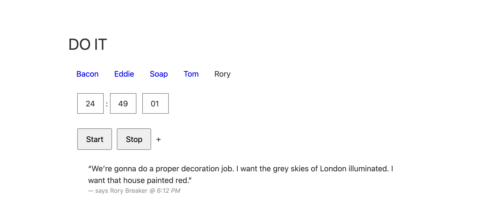

# Lock Stock Pomodoros
[Pomodoros](http://pomodorotechnique.com) with [Lock Stock quotes](http://www.imdb.com/title/tt0120735/quotes) at the end of each one.

> Right. Let's sort the buyers from the spyers, the needy from the greedy, and those who trust me from the ones who don't, because if you can't see value here today, you're not up here shopping. You're up here shoplifting.



Works offline, installs as a PWA, and keeps a log of the quotes it has paid out.

## Adding a quote

Paste a line into the relevant `quotes/*.txt` and save. One quote per line, no
escaping, no build step.

## Building

It's [Elm](https://elm-lang.org/). There is no bundler and no CI, so the
compiled `main.js` is committed — rebuild it after any change to `src/`:

```sh
elm make src/Main.elm --optimize --output=main.js
```

